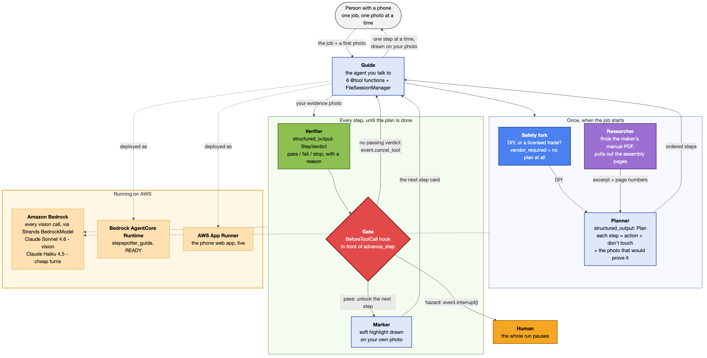
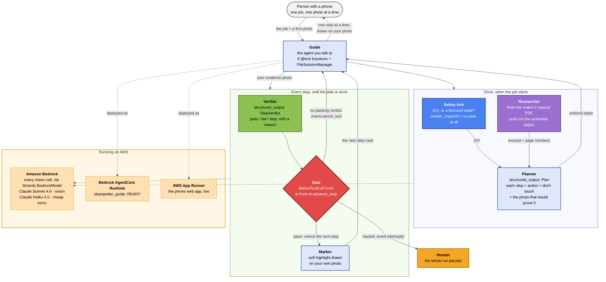

# Architecture

StepSpotter is one repair walked through by eight roles, named the way a human crew
would name them — not by software layer. **All eight are working code in this
repository today**; two of them (Verifier, Gate) were de-risked first as live spikes
against Bedrock, and the spike results are still checked in. Where something is *not*
built, this document says so in the same row and says what is used instead — no claim
here implies code that does not exist.

## The roles

| Role | What a human in this role would do | Status |
|---|---|---|
| **Guide** | The person you actually talk to. Shows you the current step card, takes your photo, relays what the Verifier said in plain words, asks for a retake. | **Built** (`src/stepspotter/guide.py`) |
| **Planner** | Looks at the job and the first photo, writes the ordered list of steps — each with an action, a "don't touch," and what photo would prove it's done. | **Built** (`src/stepspotter/planner.py`) — the safety fork below also lives here |
| **Marker** | Draws on your photo for the card: a highlight where the thing is, a number, the "don't touch" zone in red. | **Built** (`src/stepspotter/marker.py`) |
| **Verifier** | Looks at your evidence photo and says pass/fail/stop, with a reason. | **Built + spiked** (`src/stepspotter/verifier.py`, Spike A) |
| **Gate** | Physically will not let the Guide say "next step" unless the Verifier already said pass for *this* step. | **Built + spiked** (`src/stepspotter/gate.py`, Spike B) |
| **Safety fork** | Before any step is written: is this even a DIY job, or does it need a professional (mains electrical inside a panel, gas, roofing, structural)? | **Built** — it is the Planner's *first* decision, in the same typed answer: `safety_class="vendor_required"` returns an empty step list and a plain reason instead of a plan (`src/stepspotter/planner.py:26-35, 95-98`; `tests/test_web.py::test_vendor_required_returns_no_steps`) |
| **Researcher** | Given a brand and model, finds the manufacturer's own manual online, downloads it and pulls out the assembly pages, so the Planner writes from the maker's words and can cite the page. | **Built** (`src/stepspotter/research.py`; evidence: `research-epx3030-2026-09-09.md`) |
| **Memory** | Remembers what's already been done in this house, so the next job doesn't start from zero — and keeps the conversation itself when the terminal is closed mid-repair. | **Built** (`src/stepspotter/memory.py`; the conversation via `strands.session.FileSessionManager`) |

## Which Strands feature, at which step, instead of what alternative

This is the table the judging rubric's Technical Implementation criterion asks
for directly ("How thoroughly and skillfully does the project use Strands
Agents?") — naming the mechanism, the step it sits at, and the alternative it
replaces, the way the pattern-mining across 25 winning Devpost pages found in
every strong AWS entry (`docs/WIDE-BRAINSTORM-2026-09-04-INTERIM.md` §5: "which
service, at which step, instead of which alternative — not a tag").

| Step | Strands feature | Verified | Instead of |
|---|---|---|---|
| Verifier judges one photo against one claim | `structured_output_model=` on an `Agent` call — typed `StepVerdict{passed, confidence, reason}` (`agent(blocks, structured_output_model=StepVerdict)`) | ✅ Spike A | Parsing free-text prose with a regex, or trusting an unstructured claim in the model's own words |
| Gate blocks "move to the next step" | `BeforeToolCallEvent.cancel_tool` — a hook that fires before the SDK invokes `advance_step`, cancelling it in code with a reason the model reads back as a tool result | ✅ Spike B | A system-prompt instruction alone ("please don't skip steps") — proven fragile: with a permissive prompt the model *will* call `advance_step` on its own, and only the hook stops it (Spike B integration run, Turn 1) |
| Escalating a hazard (hot/swollen, gas smell, exposed live wire) | `event.interrupt(name, reason)` from inside the same hook — raises `InterruptException`, the whole agent run pauses with `stop_reason='interrupt'` until a human answer resumes it. (The SDK also ships `strands.vended_interventions.HumanInTheLoop` for a standing policy across many tools; we do not use it — the hook's own `interrupt` is the whole path here.) | ✅ Spike B (`escalate_stop_condition`, `test_stop_condition_escalates_to_a_human_via_interrupt`) | Cancelling the tool call and hoping the model stops talking — a cancel lets the loop *continue*, which is the wrong shape for "a person needs to see this now" |
| Guide talks to the user while Planner/Marker/Verifier do their jobs | The Guide's six `@tool` functions call the Planner, Marker and Verifier as plain Python, each of which opens its *own* `Agent` on Bedrock — separate calls, separate prompts, separate typed outputs | ✅ Built, but **not** as the SDK's "agent as tool" multi-agent pattern — we wire the sub-agents ourselves, and say so rather than claiming a pattern we did not use | One single agent and one giant prompt doing planning, verifying and chatting in the same call — harder to gate (the cancel hook only sits in front of tool calls) and harder to keep the Verifier's judgment independent of what the Guide has already told the user |
| Drawing a highlight on the user's photo | The Marker asks the vision model for boxes, snaps each one to a coarse grid and renders it with PIL as a translucent highlight — never a crisp "it is exactly here" rectangle (`marker.py`: `locate`, `snap_to_grid`, `prepare_boxes`, `render_marked_photo`, `make_card`) | ✅ Built, and spiked first (Spike A §4) | Trusting the model's raw bounding-box pixel coordinates as ground truth — Spike A measured 3 hit / 10 rough / 1 miss out of 14 boxes, with small hardware the worst case |
| Remembering the house across jobs, and the chat across a closed terminal | `strands.session.FileSessionManager(session_id, storage_dir)` passed as `Agent(session_manager=...)` — a new process with the same session id gets the whole message history back, so `stepspotter chat --session afternoon` carries on the same repair (`S3SessionManager`, same interface, is the deployed-box version). On top of it `memory.py` keeps a plain `data/house-memory.json` — tools owned, steps that passed, what was escalated — folded into the Planner's prompt by `memory.augment_task()` | ✅ live (`data/demo/guide-chat/resume.log`: process 1 planned the job and quit, process 2 answered "where were we?" with the right job and step) | Asking for the panel, the tools and where they stopped at the start of every job — and losing the conversation the moment the phone locks |
| The person just talks to it, in one chat | `stepspotter chat [--session S] [--say ...]` — one `Agent` carrying the five Guide tools, the gate hook and the session manager; `--permissive` swaps in the agreeable prompt so the gate is the only thing left stopping a skip | ✅ live (`data/demo/guide-chat/`, five turns on a real photo) | A fixed CLI wizard where the person has to know the next command instead of saying "done, here's the photo" |
| Deciding DIY-vs-professional before any step is planned | The Planner's typed `Plan` carries `safety_class` and `vendor_reason`, and the code empties the step list when the answer is `vendor_required` — so the refusal is structural, not a sentence the model may or may not add (`planner.py:26-35, 95-98`) | ✅ Built (`tests/test_web.py::test_vendor_required_returns_no_steps`) | Letting the Planner produce steps for a job that should never have gotten steps. Still on the list: lifting this into a *separate* call before the Planner runs at all, so a plan is never generated and then discarded |

## Why a hook and not a smarter prompt (the one-sentence version for judges)

Spike B's own gotcha #1 says it plainly: *"a well-behaved model hides a broken
gate."* With the honest system prompt, the model refused to skip steps on its
own — which proves nothing about whether the gate works. The integration run
therefore uses a **deliberately permissive prompt** ("the user is always right,
call `advance_step` immediately") so the *only* thing standing between the user
and the next step is code, not manners. That is the whole argument for building
the gate as a `BeforeToolCall` hook instead of relying on prompt engineering: a
hook cannot be talked out of its job.

## Diagram

Rendered from the mermaid source below to `architecture.png` (2184x1109) and
`architecture.svg` with `mmdc` (mermaid-cli 11.17.0):
`mmdc -i arch.mmd -o architecture.png -w 2200 -H 1600 -b white`.

## Files this maps to

- `src/stepspotter/verifier.py` — Verifier (structured output, per Spike A shapes) — **Built**
- `src/stepspotter/gate.py` — Gate (the `StepGate` hook, promoted from `spikes/spike_gate.py`) — **Built**
- `src/stepspotter/planner.py` — Planner, including the safety fork (no separate `safety.py`) — **Built**
- `src/stepspotter/marker.py` — Marker — **Built**
- `src/stepspotter/research.py`, `data/manuals/` — Researcher. Sources are tried in a
  fixed order — writable cache, the cache baked into the image, the checked
  `index.json`, DuckDuckGo, Brave — and the one that answered, plus the reason each
  earlier one did not, is written to the job trace and shown on the step card. The
  baked cache is what makes a hosted demo independent of a search engine: the
  container filesystem is ephemeral, so without it every first request would go
  online, where a rate limit looks exactly like "this model has no manual" — **Built**
- `src/stepspotter/guide.py` — Guide (the tools + agent) — **Built**
- `src/stepspotter/web/` — the phone-first web UI (FastAPI) — **Built**
- `src/stepspotter/evalharness.py`, `fixtures/onq-keystone-smoke/` — the eval harness + smoke fixtures — **Built**
- `src/stepspotter/memory.py` — Memory: house memory on disk; the conversation itself is the SDK's `FileSessionManager` — **Built**
- `tests/test_gate.py`, `tests/test_card.py`, `tests/test_guide_chat.py`, and the rest of `tests/` — 114 passed, 1 skipped with the `agentcore` extra installed; 101 passed, 2 skipped from a plain `pip install -e ".[dev]"`, which is the cold-clone path (`python -m pytest -q`)
- `docs/EVAL-PLAN.md` — the eval set that exercises Verifier + Gate together against a real job
