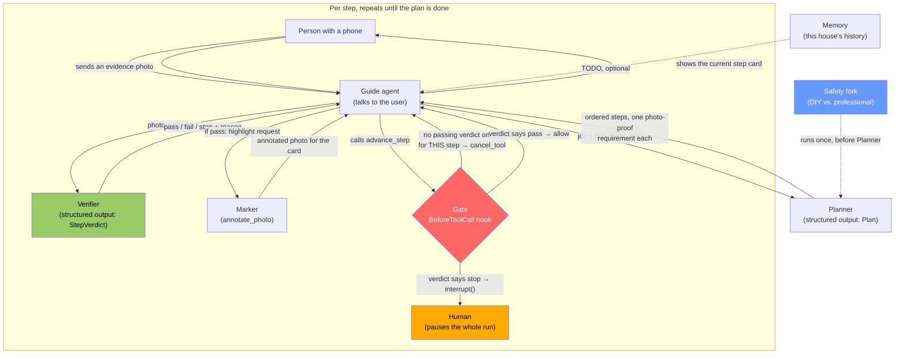

# Architecture

StepSpotter is one repair walked through by six roles, named the way a human crew
would name them — not by software layer. Two of the six are verified working code
today (Spike A, Spike B); the rest are the plan the spikes exist to de-risk.
**Anything below marked `TODO` is not built yet** — no claim here implies code that
does not exist.

## The roles

| Role | What a human in this role would do | Status |
|---|---|---|
| **Guide** | The person you actually talk to. Shows you the current step card, takes your photo, relays what the Verifier said in plain words, asks for a retake. | **Built** (`src/stepspotter/guide.py`) |
| **Planner** | Looks at the job and the first photo, writes the ordered list of steps — each with an action, a "don't touch," and what photo would prove it's done. | **Built** (`src/stepspotter/planner.py`) — the safety fork below also lives here |
| **Marker** | Draws on your photo for the card: a highlight where the thing is, a number, the "don't touch" zone in red. | **Built** (`src/stepspotter/marker.py`) |
| **Verifier** | Looks at your evidence photo and says pass/fail/stop, with a reason. | **Built + spiked** (`src/stepspotter/verifier.py`, Spike A) |
| **Gate** | Physically will not let the Guide say "next step" unless the Verifier already said pass for *this* step. | **Built + spiked** (`src/stepspotter/gate.py`, Spike B) |
| **Safety fork** | Before any of the above starts: is this even a DIY job, or does it need a professional (mains electrical inside a panel, gas, roofing, structural)? | `TODO` (design only, see `diy-vs-vendor-gate.md` reference in the concept doc) |
| **Memory** | Remembers what's already been done in this house, so the next job doesn't start from zero. | `TODO`, optional (see concept doc §8, cut if time runs out) |

## Which Strands feature, at which step, instead of what alternative

This is the table the judging rubric's Technical Implementation criterion asks
for directly ("How thoroughly and skillfully does the project use Strands
Agents?") — naming the mechanism, the step it sits at, and the alternative it
replaces, the way the pattern-mining across 25 winning Devpost pages found in
every strong AWS entry (`docs/WIDE-BRAINSTORM-2026-09-04-INTERIM.md` §5: "which
service, at which step, instead of which alternative — not a tag").

| Step | Strands feature | Verified | Instead of |
|---|---|---|---|
| Verifier judges one photo against one claim | `structured_output_model=` on an `Agent` call — typed `StepVerdict{passed, confidence, reason}` (`agent(blocks, structured_output_model=StepVerdict)`) | ✅ Spike A | Parsing free-text prose with a regex, or trusting an unstructured claim in the model's own words |
| Gate blocks "move to the next step" | `BeforeToolCallEvent.cancel_tool` — a hook that fires before the SDK invokes `advance_step`, cancelling it in code with a reason the model reads back as a tool result | ✅ Spike B | A system-prompt instruction alone ("please don't skip steps") — proven fragile: with a permissive prompt the model *will* call `advance_step` on its own, and only the hook stops it (Spike B integration run, Turn 1) |
| Escalating a hazard (hot/swollen, gas smell, exposed live wire) | `event.interrupt(name, reason)` from inside the same hook — raises `InterruptException`, the whole agent run pauses with `stop_reason='interrupt'` until a human answer resumes it; or the vended `strands.vended_interventions.HumanInTheLoop` for a standing policy across many tools | ✅ Spike B (`escalate_stop_condition`, `test_stop_condition_escalates_to_a_human_via_interrupt`) | Cancelling the tool call and hoping the model stops talking — a cancel lets the loop *continue*, which is the wrong shape for "a person needs to see this now" |
| Guide talks to the user while Planner/Marker/Verifier do their jobs | Multi-agent "agent as tool" — Planner, Marker and Verifier exposed as `@tool`-wrapped sub-agents that the Guide agent calls | `TODO` | One single agent and one giant prompt doing planning, verifying and chatting in the same call — harder to gate (the cancel hook only sits in front of tool calls) and harder to keep the Verifier's judgment independent of what the Guide has already told the user |
| Drawing a highlight on the user's photo | `annotate_photo` tool: take the Verifier's/Marker's box or grid cells, render with PIL as a translucent highlight, never a crisp "it is exactly here" rectangle (Spike A §4 recommendation) | `TODO`, mechanism spiked | Trusting the model's raw bounding-box pixel coordinates as ground truth — Spike A measured 3 hit / 10 rough / 1 miss out of 14 boxes, with small hardware the worst case |
| Remembering the house across jobs | AgentCore Memory / a Strands session manager, keyed per household | `TODO`, optional | Asking the user to re-describe their panel/house every single job |
| Deciding DIY-vs-professional before any step is planned | A first, separate agent call (or a rule-based check on job type + voltage) gating whether the Planner runs at all | `TODO` | Letting the Planner produce steps for a job that should never have gotten steps — the DIY/vendor decision has to happen *before* planning, not be caught after |

## Why a hook and not a smarter prompt (the one-sentence version for judges)

Spike B's own gotcha #1 says it plainly: *"a well-behaved model hides a broken
gate."* With the honest system prompt, the model refused to skip steps on its
own — which proves nothing about whether the gate works. The integration run
therefore uses a **deliberately permissive prompt** ("the user is always right,
call `advance_step` immediately") so the *only* thing standing between the user
and the next step is code, not manners. That is the whole argument for building
the gate as a `BeforeToolCall` hook instead of relying on prompt engineering: a
hook cannot be talked out of its job.

## Diagram

## Files this maps to

- `src/stepspotter/verifier.py` — Verifier (structured output, per Spike A shapes) — **Built**
- `src/stepspotter/gate.py` — Gate (the `StepGate` hook, promoted from `spikes/spike_gate.py`) — **Built**
- `src/stepspotter/planner.py` — Planner, including the safety fork (no separate `safety.py`) — **Built**
- `src/stepspotter/marker.py` — Marker — **Built**
- `src/stepspotter/guide.py` — Guide (the tools + agent) — **Built**
- `src/stepspotter/web/` — the phone-first web UI (FastAPI) — **Built**
- `src/stepspotter/evalharness.py`, `fixtures/onq-keystone-smoke/` — the eval harness + smoke fixtures — **Built**
- `memory.py` — `TODO`, optional
- `tests/test_gate.py`, `tests/test_card.py`, and the rest of `tests/` — 40 passed, 1 skipped (`python -m pytest -q`)
- `docs/EVAL-PLAN.md` — the eval set that exercises Verifier + Gate together against a real job
